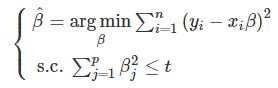
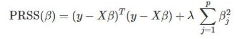
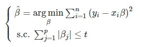
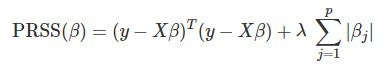
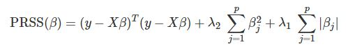
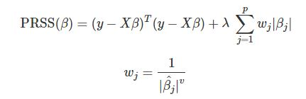
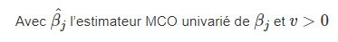
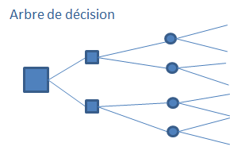
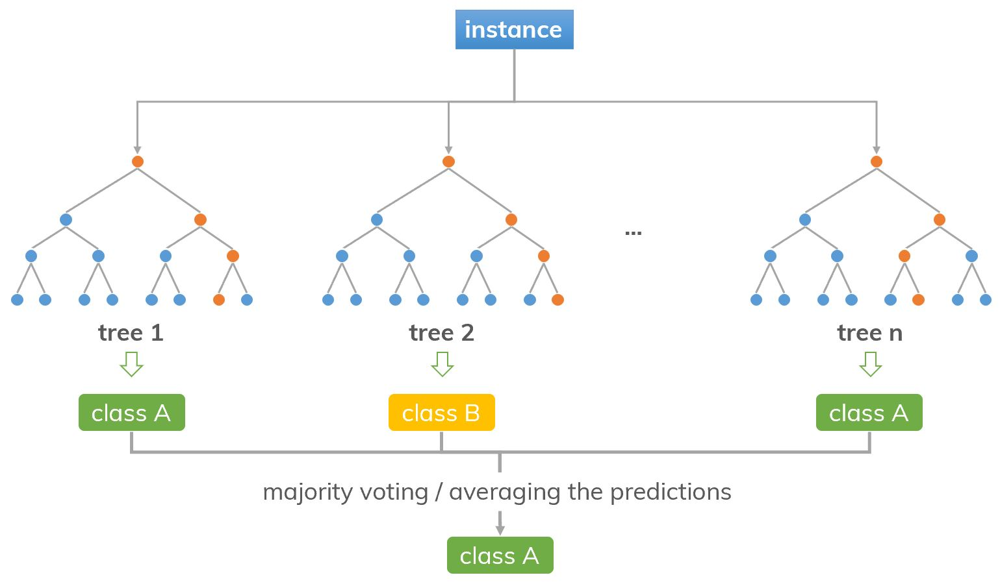

<p style='text-align: justify;'> 
On parle depuis quelques années du phénomène de Big Data, que l'on traduit souvent par "données massives" ou "grosses données". Les données massives est un avantage pour le statisticien ou le data scientist car elles augmentent le nombre d'exemples pour la modélisation. 
Cependant, si le nombre de variables augmente, il faut augmenter le nombre d'observations exponentiellement pour avoir la même précision.La multiplication des dimensions rend l'analyse de plus en plus complexe : c'est ce qu'on appelle le fléau de la dimension.
Une solution à ce fléau consiste à faire appel  des méthodes de réduction de dimension. C'est ce dont nous allons voir avec les méthodes de pénalisation et d'agrégation.
</p>
 
# **Méthodes de pénalisation** : 

Les méthodes de pénalisation permettent de régler le problème de la multicolinéarité entre les variables dû aux données massives.

Pour cela, nous allons introduire le paramètre λ dans la régression pour permettre de réduire la variabilité de l'estimateur MCO.
Le λ contrôle l'amplitude des coefficients ou leur niveau de rétrécissement.

Lorsque λ tend vers 0, le terme de pénalité n'a aucun effet, la régression produira les coefficient classiques des MCO. Lorsque λ tend vers infini, l'impact de la pénalité augmente et les coefficients se rapprochent de 0.

La valeur optimale du paramètre de régularisation λ peut être obtenue par validation croisée.


## Régression Ridge : 

La régression Ridge correspond à la méthode des MCO sous une contrainte d'inégalité portant sur les coefficients : 

```{r pic1, echo=FALSE, fig.align="center", out.width = '25%'}

```

La fonction objective à minimiser équivaut à : 
```{r pic2, echo=FALSE, fig.align="center", out.width = '35%'}

```

Cette fonction à la particulatité de ne pas annuler les coefficients β mais de les réduire et de les faire tendre vers 0.


## Régression Lasso : 

Cette pénalisation est adaptée lorsque p ≥ n. Elle peut être utile aussi dans le cas p < n pour éviter sur-ajustement via la sélection de variables, dès lors que p est élevé. 

La régression Lasso correspond à la méthode des MCO sous une contrainte d'une norme 1 : 

```{r pic3, echo=FALSE, fig.align="center", out.width = '25%'}

```

La fonction objective à minimiser équivaut à : 

```{r pic4, echo=FALSE, fig.align="center", out.width = '35%'}

```

<p style='text-align: justify;'> 
Contrairement à la régression Ridge qui réduit les coefficients vers 0 sans les annuler, la régression Lasso réduit les coefficient les plus élevés vers 0 et annule les coefficient les plus failes.
La régression Lasso procède donc à la fois à de la sélection et à la régularisation des coefficients.
</p>


## Elastic-Net :
La régression Elastic Net combine à la fois les pénalisations Ridge et Lasso présentées plus haut. 

La fonction objective à minimiser équivaut à : 

```{r pic5, echo=FALSE, fig.align="center", out.width = '45%'}

```

avec λ1 et λ2 les deux paramètres de régularisation Lasso et Ridge respectivement.

Cette méthode permet de faire de la sélection de plus de n variables et faire de la sélection groupée de variables corrélées dès lors qu'une est admise dans le modèle. 


## Adaptive Lasso : 

L'estimateur est construit comme le Lasso, mais en réalisant une pénalisation différente pour chaque coefficient. Cette pénalisation est d'autant plus importante que le coefficient semble proche de 0.

Cette méthode à la capacité de mieux sélectionner les variables pertinentes car elle permet d'annuler le risque de selectionner des variables correspondant à du bruit. 

La fonction objective à minimiser équivaut à : 
```{r pic6, echo=FALSE, fig.align="center", out.width = '40%'}

```
```{r pic7, echo=FALSE, fig.align="center",out.width = '35%'}

```


# **Méthodes d'agrégation** : 

## Random Forest :

Un random forest est constitué d'un ensemble d'arbres de décision indépendants.

```{r pressure, echo=FALSE, fig.align="center",out.width = '35%'}

```


Le défaut majeur de l'arbre de décision est que sa performance est fortement dépendante de l'échantillon de données de départ. Par exemple, l'ajout de quelques nouvelles données dans la base d'apprentissage peut modifier radicalement le modèle et les résultats.

Pour lutter contre ce défaut, on peut utiliser une multitude d’arbres : une forêt d'arbres.

Les random forests réduisent la variance observée dans les arbres de décision :

  - En utilisant différents échantillons pour l’entraînement,
  - En spécifiant des sous-ensembles de caractéristiques aléatoires,
  - En construisant et combinant de petits arbres (peu profonds)

La prédiction faite par le random forest pour des données inconnues est alors la moyenne (ou le vote, dans le cas d'un problème de classification) de tous les arbres.

```{r pressure2, echo=FALSE, fig.align="center", out.width = '50%'}

```


## Boosting :

Pour le Boosting, les algorithmes ne sont plus indépendants. Au contraire, chaque « weak learner » est entraîné pour corriger les erreurs des « weak learner » précédents.

## AdaBoost  :

Pour demander la prédiction d’Adaboost sur une observation, il faut interroger chaque « weak learner » et pondérer chaque réponse en fonction de la note qu’ils ont obtenu. 
La prédiction du « strong learner » sera la moyenne de toutes les réponses des « weak learner ».

```{r pressure3, echo=FALSE, fig.align="center", out.width = '50%'}
knitr::include_graphics("Images/ADA.png")
```


## Gradient Boosting :

L’algorithme de Gradient Boosting a beaucoup de points communs avec Adaboost, comme Adaboost, chaque “weak learner” est entraîné pour corriger les erreurs des “weak learners” précédents.

Néanmoins, contrairement à Adaboost, les “weak learners” ont tous autant de poids dans le système de votation, peu importe leur performance.


