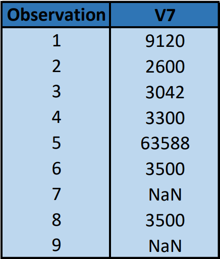

# Traitement


Nous utilisons un ensemble de données populaire fourni par une institution financière pour la compétition Kaggle « Donnez-moi du crédit ».

Celle-ci est souvent utilisée dans les demandes de notation de crédit.

Elle est constituée de 150 000 observations.


## Traitement initial de notre base


La base de donnée fournie comportait un grand nombre de valeurs manquantes. Nous en notons 29 731 pour la variable V7.

Nous avons donc imputées celles-ci par la moyenne relative à chaque variable. 

Par exemple pour la variable V7 correspondant au montant des revenus mensuels :

```{r pressure, echo=FALSE, fig.align="center",out.width = '25%'}

```

Nous avons remplacé ces "NaN" par la moyenne de la variable V7, soit par la valeur 6670.221.


## Modélisation


Pour les modélisations que nous avons réalisé, nous avons utilisé des **hyperparamètres** sélectionnés par **validation croisée**.

Cela permet en effet, d'optimiser notre modèle avec des paramètres optimaux en diminuant l'effet de sur-apprentissage.

Nous choisissons donc la valeur du paramètre qui donne l'erreur moyenne de validation croisée la plus faible.


## Partition


Nous avons également partitionner notre base en deux échantillons : apprentissage et test. 

Les observations sont sélectionnées de manière aléatoires.

 + **L'échantillon d'apprentissage** permet d'estimer le modèle.
 + **L'échantillon test** permet d'en évaluer les performances.
